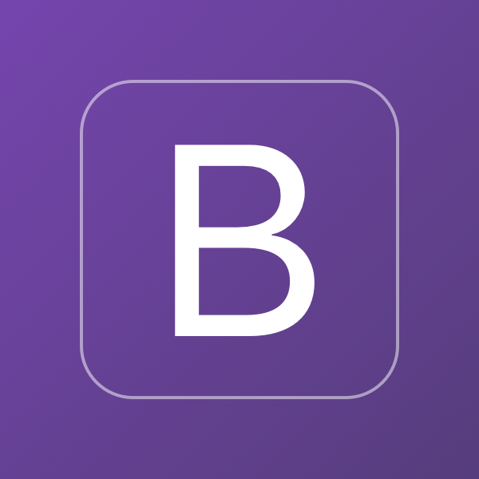

# SilentSymphony - Focus & Relax

SilentSymphony is a mobile application available on [Google Play](https://play.google.com/store/apps/details?id=pl.dev3win.silentsymphony). The app was built from scratch without relying on tutorials, following my own ideas. The design and features of the app were inspired by existing applications in the market. During the development process, I mainly referred to the Flutter documentation, Stack Overflow, and ChatGPT.

## Features
- Simultaneous playback of multiple sounds at different volume levels.
- Ability to save a set of sounds as a template.
- Predefined templates with the option to edit and restore sounds settings to their initial state.
- Animated Timer for counting down the playback time. Ability to deactivate the Timer or select a custom time using the time picker.
- Rate App - redirection of the user to the Google Play Store (if installed) or to a website.
- Share App - option to recommend the app to friends.

## Design
- Material 3
- Themes Playground M3

## Dependencies
- animations
- collection
- cupertino_icons
- equatable
- firebase_core
- firebase_crashlytics
- flex_color_scheme
- flutter_bloc
- flutter_svg
- just_audio
- responsive_framework
- share_plus
- shared_preferences
- url_launcher

## Dev Dependencies
- bloc_test
- flutter_launcher_icons
- flutter_lints
- flutter_native_splash
- flutter_test: sdk, lint, mockito

## Views:

  
  
  
  
  

